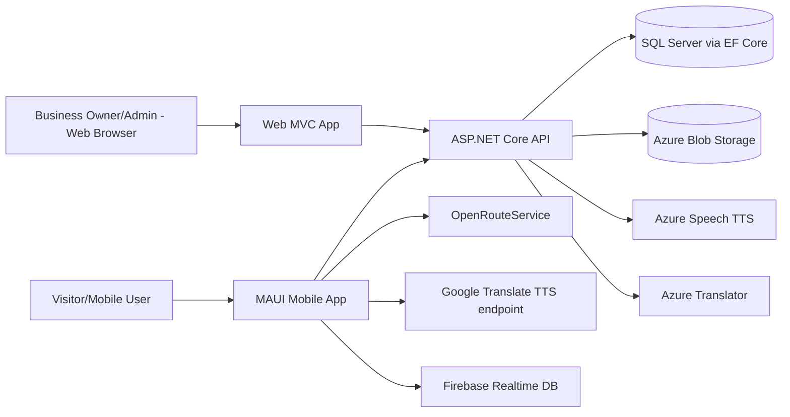
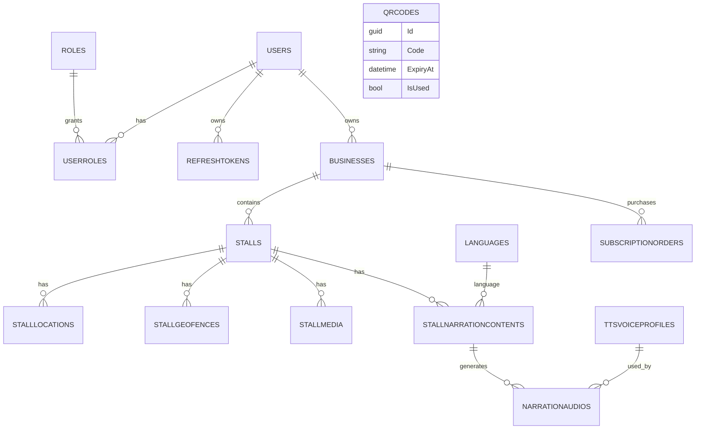
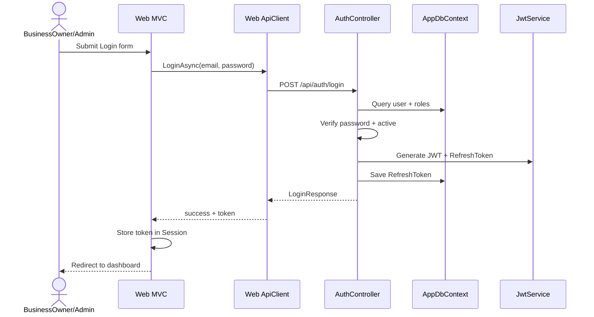
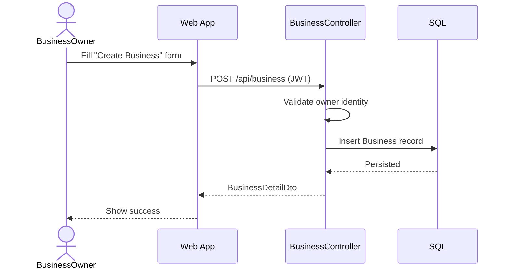
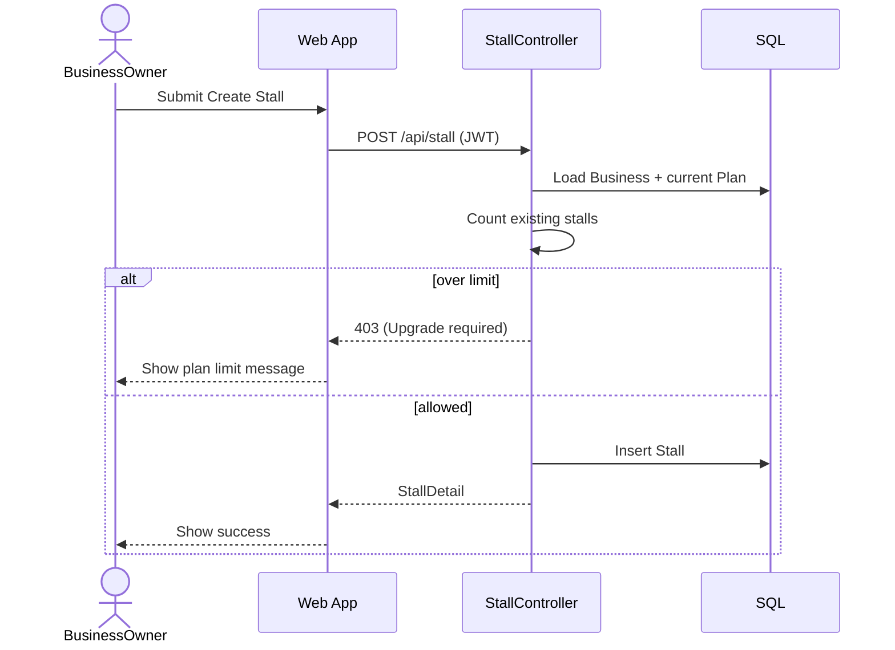
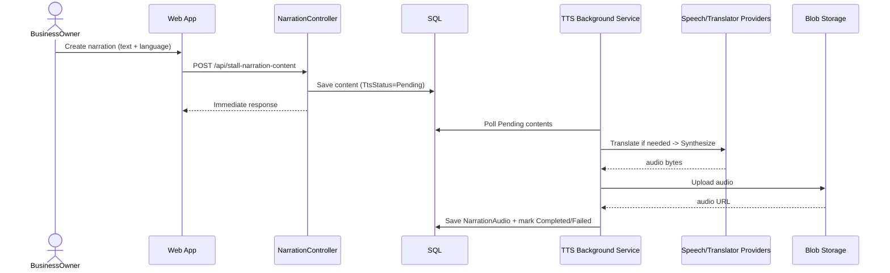
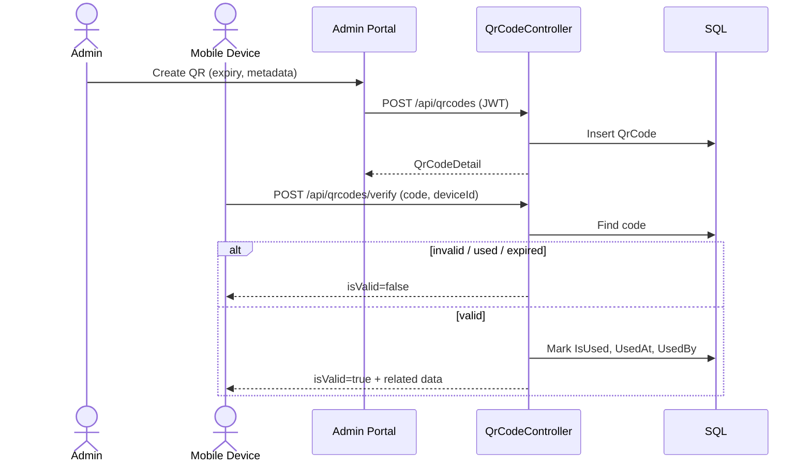
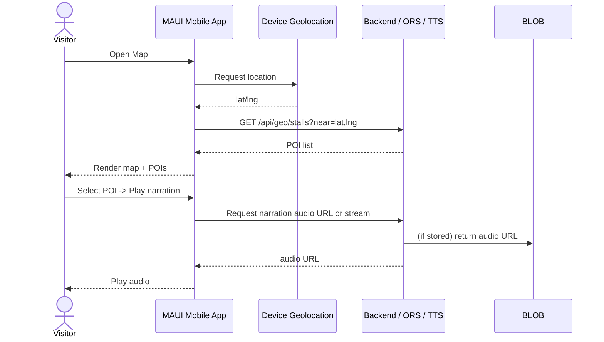

# PRD – FoodTourGuide / VinhThucAudioGuide

> Phiên bản: 1.0  
> Nguồn phân tích: mã nguồn hiện có trong repo (`Api`, `Web`, `VinhThucAudioGuide`, `Domain`, `Infrastructure`, `Shared`)

---

## 1) Mục tiêu sản phẩm

Xây dựng hệ sinh thái hướng dẫn du lịch/ẩm thực đa nền tảng gồm:
- **API Backend (.NET)**: quản lý người dùng, business, gian hàng, nội dung thuyết minh, QR, subscription, dữ liệu vị trí.
- **Web Admin/Business Portal (ASP.NET MVC)**: quản trị hệ thống, vận hành business/stall/narration/subscription.
- **Mobile App (MAUI)**: trải nghiệm bản đồ, chọn điểm tham quan, phát thuyết minh đa ngôn ngữ (hiện có dữ liệu mẫu cục bộ + Firebase service dự phòng).

Giá trị cốt lõi:
- Quản lý nội dung thuyết minh theo gian hàng.
- Tự động sinh audio TTS (Azure Speech + Azure Translation).
- Quản trị gói dịch vụ cho chủ business.
- Hỗ trợ xác thực JWT + refresh token.

---

## 2) Phạm vi (Scope)

### 2.1 In-scope
1. Đăng ký/đăng nhập/refresh token.
2. Quản lý Business, Stall, StallLocation, StallGeoFence, StallMedia.
3. Quản lý nội dung thuyết minh (StallNarrationContent) + audio (TTS/human upload).
4. Quản lý ngôn ngữ, voice profile, sở thích thiết bị.
5. Quản lý mã QR (tạo, tải ảnh, verify, đánh dấu đã dùng).
6. Subscription (Free/Basic/Pro), tạo đơn thanh toán mock.
7. Logging vị trí thiết bị/visitor.
8. Web dashboard/admin pages cho vận hành.

### 2.2 Out-of-scope (theo code hiện tại)
- Cổng thanh toán thật (hiện là **mock card validation**).
- Mobile QR scan hoàn chỉnh end-to-end với API (màn `QrPage` còn tối giản).
- Dòng triển khai production (Dev config vẫn để trống key/connection string).

---

## 3) Kiến trúc tổng quan

### 3.1 Thành phần chính
- **API**: `Program.cs`, controllers trong `Api/Controllers`, service trong `Api/Application/Services`.
- **Persistence**: `AppDbContext` + entity configuration + migrations.
- **Web**: Controllers + ApiClients gọi ngược API qua HttpClient + Session token.
- **Mobile**: `MainPage`, `HomePage`, `SettingsPage`, `MapViewModel`, `FirebaseService`.

---

## 4) Vai trò người dùng

1. **Admin**
   - Quản lý user/role, QR code, subscription của business, dashboard hệ thống.
2. **BusinessOwner**
   - Quản lý business, stall, nội dung narration/audio, mua gói dịch vụ.
3. **Visitor/Device (anonymous hoặc app client)**
   - Lấy dữ liệu stall public/map, verify QR, gửi telemetry location, lưu preference thiết bị.

---

## 5) Quy tắc nghiệp vụ chính

1. **Phân quyền**
   - Endpoint nhạy cảm yêu cầu JWT + role (Admin / BusinessOwner).
2. **Plan giới hạn tính năng**
   - Số lượng stall phụ thuộc plan.
   - Free không hỗ trợ TTS narration.
3. **Narration active rule**
   - Trong cùng stall, khi một content active thì content active khác bị deactivate.
4. **TTS async**
   - Content tạo/cập nhật script sẽ set trạng thái `Pending`, background service xử lý sau.
5. **Subscription mock**
   - Card hợp lệ khi đủ 16 chữ số.
   - Khi thanh toán thành công: nâng cấp plan + cập nhật hạn dùng.
6. **QR usage**
   - QR chỉ hợp lệ nếu tồn tại, chưa dùng, chưa hết hạn.
   - Verify thành công sẽ mark used ngay.

---

## 6) Data model nghiệp vụ (mức khái quát)

Các nhóm bảng chính (theo `AppDbContext`):

- **Identity & Access**: `Users`, `Roles`, `UserRoles`, `RefreshTokens`.
- **Business Domain**: `Businesses`, `Stalls`, `StallLocations`, `StallGeoFences`, `StallMedia`.
- **Narration & Audio**: `StallNarrationContents`, `NarrationAudios`, `TtsVoiceProfiles`, `Languages`.
- **Subscription**: `SubscriptionOrders`.
- **QR & Scan**: `QrCodes`, `ScanLogs`.
- **Preference & Telemetry**: `DevicePreferences`, `DeviceLocationLogs`, `VisitorPreferences`, `VisitorProfiles`, `VisitorLocationLogs`.

---

## 7) API chức năng chính (tóm tắt)

### 7.1 Auth
- `POST /api/auth/register/business-owner`
- `POST /api/auth/login`
- `POST /api/auth/refresh`

### 7.2 Business/Stall
- Business CRUD: `/api/business`
- Stall CRUD: `/api/stall`
- Public stalls map: `/api/stalls`

### 7.3 Narration
- Content CRUD + trạng thái TTS: `/api/stall-narration-content`
- Upload human audio: `/api/narration-audio/{id}/upload`
- Voice profile active: `/api/tts-voice-profiles/active`

### 7.4 Subscription
- Tạo order: `POST /api/subscription-orders`
- List order (admin): `GET /api/subscription-orders`
- Admin update plan business: `PUT /api/business/{id}/subscription`

### 7.5 QR
- Quản lý QR (admin): `/api/qrcodes`
- Verify QR (public): `POST /api/qrcodes/verify`

### 7.6 Device/Geo
- `GET /api/geo/stalls`
- `POST /api/device-location-log/batch`
- `GET/POST /api/device-preference`

---

## 8) Sequence diagrams (6 luồng chức năng chính)

Các luồng dưới đây tóm tắt 6 chức năng chính của hệ thống: đăng nhập, tạo business, tạo stall (kiểm tra plan), tạo narration + TTS nền, verify QR, và mobile xem bản đồ/phát thuyết minh.

## 8.1 Đăng nhập Web + lưu token session

## 8.2 BusinessOwner tạo Business

## 8.3 Tạo Stall + kiểm tra giới hạn theo Plan

## 8.4 Tạo Narration content + xử lý TTS nền

## 8.5 Verify QR (mobile) — admin tạo + device verify

## 8.6 Mobile xem bản đồ & phát thuyết minh

---

## 9) Luồng UI Web chính

1. **Auth**: Register -> Login -> Session token.
2. **Business Management**: list/search/sort/create/update/toggle active.
3. **Stall Management**: list/filter theo business, CRUD, deactivate.
4. **Narration Management**: tạo content, đổi trạng thái, xem TTS status, retry TTS, upload human audio.
5. **Subscription**: xem plans, checkout, thanh toán mock, success page.
6. **Admin**: dashboard, user-role management, subscription orders, QR code management.

---

## 10) Yêu cầu phi chức năng

1. **Bảo mật**
   - JWT + refresh token hash (SHA256).
   - BCrypt password hash.
   - Role-based authorization cho endpoint quản trị.
2. **Hiệu năng**
   - TTS xử lý nền để tránh request timeout.
   - Phân trang cho danh sách lớn (business/stall/order/users...).
3. **Khả dụng**
   - Có cơ chế reset job TTS `Processing` bị stale (>10 phút).
4. **Mở rộng**
   - Có lớp service riêng cho Translation/TTS/Geo, dễ thay provider.

---

## 11) Cấu hình & triển khai

### 11.1 Cấu hình bắt buộc backend
- `ConnectionStrings:default`
- `Jwt:Issuer/Audience/Key/ExpiryInMinutes`
- `AzureSpeech:Key + Region/Endpoint + DefaultVoice`
- `BlobStorage:ConnectionString + ContainerName`
- `AzureTranslation:Endpoint + Key (+ Region)`

### 11.2 Run local
1. `docker-compose up -d` (database)
2. `dotnet watch` (API/Web tùy startup)

---

## 12) Rủi ro & khuyến nghị

1. **Thiếu policy registration rõ ràng trong `Program.cs`**
   - Nên cấu hình `AddAuthorization(options => AddPolicy(...))` để đồng bộ với `[Authorize(Policy=...)]`.
2. **Mobile app hiện còn dữ liệu demo hardcode + QR page chưa hoàn thiện**
   - Nên chuyển hoàn toàn sang API public (`/api/stalls`, `/api/geo/stalls`, `/api/qrcodes/verify`).
3. **Mock payment chưa phù hợp production**
   - Thay bằng cổng thanh toán thật (VNPay/MoMo/Stripe...).
4. **Key cấu hình đang để trống**
   - Bổ sung secret management (User Secrets/Azure Key Vault) cho production.

---

## 13) Backlog đề xuất (giai đoạn tiếp theo)

1. Hoàn thiện mobile QR scan + verify flow end-to-end.
2. Tạo trang theo dõi trạng thái TTS realtime (SignalR hoặc polling tối ưu).
3. Thêm audit log cho thao tác admin.
4. Bổ sung test integration cho auth/subscription/narration.
5. Chuẩn hóa tài liệu API (OpenAPI tagging + examples).

---

## 14) Tiêu chí nghiệm thu PRD

- [x] Bao phủ đầy đủ 3 lớp: API + Web + Mobile.
- [x] Có sơ đồ kiến trúc tổng quan.
- [x] Có sơ đồ ER mức khái quát.
- [x] Có đầy đủ sequence diagram cho các luồng nghiệp vụ trọng yếu.
- [x] Có business rules, phạm vi, rủi ro, backlog đề xuất.

---

**Kết luận:** PRD này phản ánh trạng thái triển khai hiện tại của đồ án trong repo, đồng thời bổ sung các luồng sequence và định hướng triển khai tiếp theo để chuyển từ bản demo/học thuật sang production-ready.